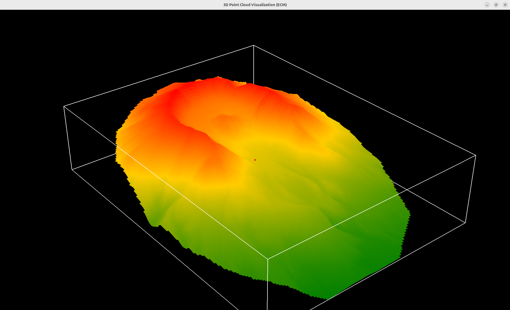
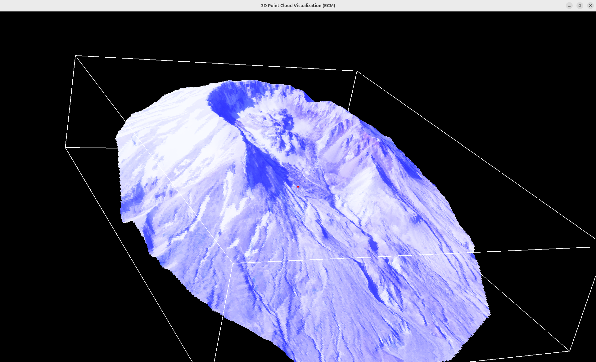
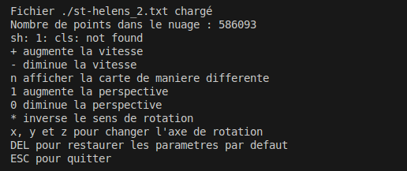

# 3D Point Cloud Visualization

## Description
Ce projet permet de visualiser un nuage de points 3D en utilisant OpenGL et GLUT. Il lit les données d'un fichier, calcule les bornes minimales et maximales ainsi que le barycentre, et affiche les points avec une grille de voxels.

Le programme propose également plusieurs modes d'affichage :
- Affichage des voxels 3D
- Carte de chaleur (heatmap)
- Affichage brut du nuage de points

## Fonctionnalités
- Lecture d'un fichier de nuage de points
- Calcul du barycentre et de la boîte englobante
- Initialisation d'une grille de voxels 2D et attribution des points
- Affichage du nuage de points avec plusieurs modes de visualisation
- Rotation, zoom et translation de la vue
- Gestion des entrées utilisateur via le clavier et la souris

## Dépendances
- OpenGL
- GLUT

## Installation
### Prérequis
Assurez-vous d'avoir installé OpenGL et GLUT sur votre machine.

### Compilation
```bash
g++ main.cpp -o point_cloud_visualization -lGL -lGLU -lglut
```

### Exécution
```bash
./point_cloud_visualization <nom_du_fichier>
```

## Utilisation
### Commandes Clavier
- **Flèches directionnelles** : Rotation de la vue
- **`+` / `-`** : Augmenter/diminuer la vitesse de rotation
- **`0` / `1`** : Modifier la perspective
- **`n`** : Changer le mode d'affichage (Voxels, Heatmap, Nuage brut)
- **`ESC`** : Quitter le programme

### Commandes Souris
- **Clic gauche** : Rotation de la vue
- **Clic milieu** : Déplacement
- **Molette** : Zoom avant/arrière

## Structure du Code
- `main.cpp` : Contient l'ensemble du code pour la gestion du nuage de points et l'affichage.
- `roundPrecision()` : Fonction permettant d'harmoniser les coordonnées pour éviter les erreurs d'affichage.
- `InitVoxelGrid()` : Génération et attribution des points aux voxels.
- `DrawVoxels()` : Affichage des voxels en fonction des points collectés.
- `DrawHeatMap()` : Affichage d'une carte de chaleur basée sur l'altitude.
- `CollecterZParSommet()` & `CalculerZMoyen()` : Collecte et moyenne des valeurs Z pour une meilleure continuité graphique.

## Fichier de données
Le programme charge un fichier `.xyz` contenant les points sous la forme :
```plaintext
x y z r g b
```
Les valeurs `r g b` sont des composantes de couleur normalisées entre 0 et 1.

## Améliorations futures
- Ajout de shaders pour améliorer le rendu graphique
- Optimisation de l'affichage des voxels
- Gestion des fichiers plus volumineux avec des structures de données optimisées

Aperçu
------





## Auteur
Développé par [Josias Hod](https://github.com/josiashod)

## Licence
Ce projet est sous licence MIT. Vous êtes libre de l'utiliser et de le modifier selon vos besoins.

